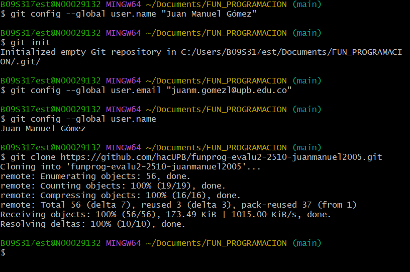

# Repositorio remoto 

Para crear un repositorio remoto, primero se debe tener una cuenta en GitHub y un repositorio local. Luego, desde GitHub, se crea un nuevo repositorio. Después de crearlo, hay que vincularlo con el repositorio local. Para vincularlos, se usa el siguiente comando:  
```
git remote add origin "link del repositorio remoto de GitHub"
```
Una vez hecho esto, ya podemos editar el repositorio local realizando cambios en los archivos y haciendo commits. Después de esto, usamos el comando `git push` para subir los cambios al repositorio remoto.

